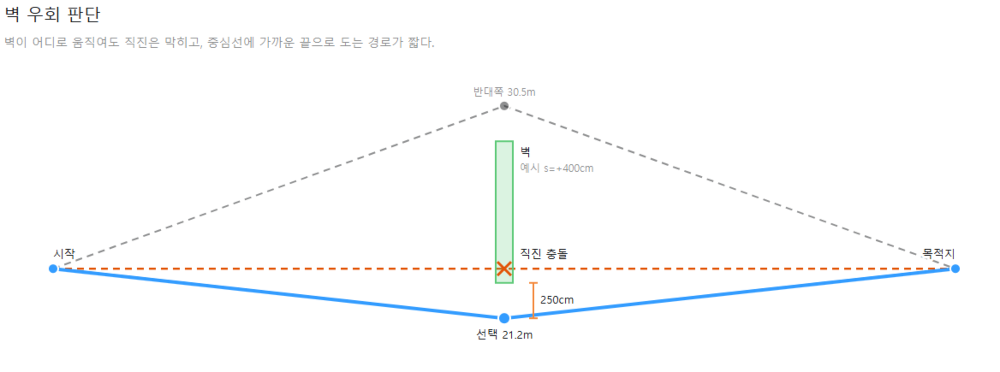
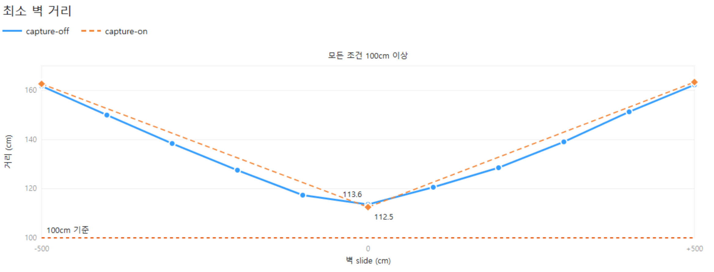
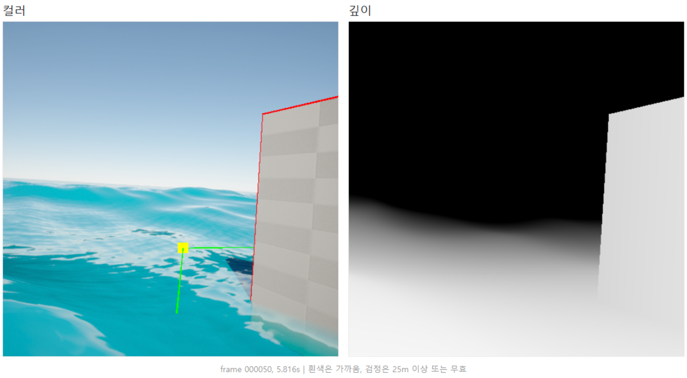

# 수상 자율주행 시뮬레이션 구현 보고서

## 1. 개요와 실행 방법

Unreal Engine 5.5.4 C++로 바다 위 선박의 관성 이동 모델, 런타임 코스 생성, 벽 우회 자율주행, 전방 컬러와 깊이 캡처를 구현했다. 레벨을 열고 Play를 누르면 선박과 시작점, 끝점, 벽이 코드로 생성되고 사용자 입력 없이 주행과 이미지 저장이 시작된다. 웹 뷰어는 프레임워크와 런타임 패키지 없이 TypeScript와 브라우저 ES 모듈만 사용한다.

핵심 결과는 실제 수면에서 14개 조건을 모두 충돌 없이 완주했고, 가장 가까운 벽 간격도 112.489cm를 유지했다는 것이다. 캡처를 켠 실행에서는 512 x 512 컬러와 깊이 쌍을 100ms 목표 간격으로 저장했으며, 웹에서 개별 PNG와 단일 파일 두 방식으로 재생했다.

빌드와 실행은 이 절에, 이동부터 저장과 웹 재생까지의 세부 구현은 2절부터 6절에 정리했다. 테스트 명령과 사람이 확인할 순서는 7절에서 그대로 재현할 수 있다.

### 필수 항목 충족

| 항목 | 상태 | 근거 |
| --- | --- | --- |
| 1a 바다 위 선박 | 충족 | Water plugin 위에 200 x 100 x 100cm 충돌 상자 선박. 2절 |
| 1b 이동 모델 직접 구현 | 충족 | 느린 가속, 물 저항, 속도 비례 선회를 직접 적분. 2절 |
| 1c 우회 시나리오 배치 | 충족 | 20m 코스, 1000 x 500 x 100cm 벽, 매 실행 -500~500cm 슬라이드. 3절 |
| 1d 자율 우회 주행 | 충족 | 입력 없이 실제 수면 14개 조건 전부 성공, 최소 벽 거리 112.489cm. 4절 |
| 2a 이미지 저장 | 충족 | 512 x 512 컬러와 깊이, 실제 시계 100ms 목표 간격. 5절 |
| 2b 웹 뷰어 | 충족 | 시간순 연속 재생, 깊이 0~255 시각화. 6절 |
| 2c 이미지 압축 | 구현 | 압축된 PNG를 index와 함께 묶은 단일 파일 `sequence.siv`. 6절 |

### 빌드

저장소 루트의 PowerShell에서 실행한다. `Binaries`와 `Intermediate`는 이 명령이 생성한다.

```powershell
$EngineRoot = Join-Path $env:ProgramFiles 'Epic Games\UE_5.5'
$Project = (Resolve-Path 'ShipAutonomySim\ShipAutonomySim.uproject').Path
& (Join-Path $EngineRoot 'Engine\Build\BatchFiles\Build.bat') `
    ShipAutonomySimEditor Win64 Development `
    "-Project=$Project" -WaitMutex
```

exit code 0을 확인한 뒤 `ShipAutonomySim/ShipAutonomySim.uproject`를 UE 5.5.4로 연다. 기본 맵은 `/Game/Maps/MainLevel`, 기본 GameMode는 `SimGameMode`이며 Water plugin이 활성화되어 있다. 영구 배치된 Directional Light, Sky Light, Sky Atmosphere를 사용하므로 `viewmode unlit`을 입력할 필요가 없다.

### Play 시 기대 동작

배가 시작점에서 스스로 출발해 벽을 우회하고 끝점에서 관성으로 정지하기까지 약 18초에서 23초가 걸린다. 그동안 컬러와 깊이 이미지가 100ms 간격으로 저장된다. 저장 위치는 다음과 같으며 실행 시각으로 폴더가 만들어진다.

```text
ShipAutonomySim/Saved/ShipCaptures/<run>/
    color_000000.png, depth_000000.png, ...
    manifest.json
    sequence.siv
```


### 웹 뷰어

```powershell
npm ci
npm run build
python -m http.server 8000
```

개별 PNG 모드는 선택한 run의 `manifest.json`과 PNG를 README 절차대로 루트에 복사한 뒤 `http://localhost:8000`에서 연다. 단일 파일 모드는 복사 없이 상대 경로를 query로 준다.

```text
http://localhost:8000/?bundle=ShipAutonomySim/Saved/ShipCaptures/<run>/sequence.siv
```

---

## 2. 선박 이동 모델

전후진을 포함한 signed speed `v`는 선형 저항과 이차 저항을 함께 사용한다. `T`는 -1에서 1로 제한된 throttle이다.

```text
dv/dt = A T - C1 v - C2 v |v|
```

조향 각속도는 현재 속도에 비례한다. 속도 0에서는 각속도도 0이 되므로 제자리 회전이 구조적으로 불가능하고, 빠를수록 큰 호를 그린다.

```text
yawRate = MaxYawRate S clamp(|v| / TurnRefSpeed, 0, 1)
```

한 내부 스텝에서 현재 속도로 가속도와 이동거리, 각속도를 계산한 뒤 forward Euler로 다음 속도와 yaw를 만든다. throttle이 0이고 다음 속도의 절댓값이 5cm/s 이하이면 속도를 0으로 고정한다. 위치를 옮기는 처리가 아니라, 저속에서 저항식이 0에 점근해 영원히 남는 미세 속도를 끝내는 수치 규칙이다.

### 파라미터

| 파라미터 | 값 |
| --- | ---: |
| 선형 저항 `C1` | 0.447501534 1/s |
| 이차 저항 `C2` | 0.000400390770 1/cm |
| 최대 추진 가속도 `A` | 105.5159376 cm/s² |
| 정지 임계속도 | 5 cm/s |
| 최대 yaw rate | 45.83662361 deg/s |
| 선회 기준 속도 | 200 cm/s |
| 최대 내부 스텝 | 1/120 s |
| tick당 최대 substep | 8회 |

값을 감으로 정하지 않고 목표 거동 네 가지를 먼저 정한 뒤 계수를 역산했다. 이차 저항이 있는 경우의 평형 속도를 근의 공식으로 풀어 `A`와 두 저항 계수를 맞췄다.

| 목표 거동 | 검증값 | 성격 |
| --- | ---: | --- |
| 최고속도 | 200 cm/s | 평형값. `v=200`, `T=1`에서 가속도 절댓값 1e-6 이하 |
| 정지에서 180 cm/s 도달 | 약 3.9917 s | 1/120s 적분 실측 |
| 200 cm/s에서 타력 정지 거리 | 약 399.9615 cm | 1/120s 적분 실측 |
| 최고속도 최소 선회반경 | 약 250 cm | 속도와 각속도에서 계산한 값 |

### 적분 안정성

파라미터를 에디터에서 바꿀 수 있으므로, 잘못된 값이 들어와 명시적 오일러 적분이 발산하는 상황을 검증으로 막았다. 저항 함수의 최대 기울기 `C1 + 2 C2 Vmax`에 스텝 크기를 곱한 값이 0.5를 넘으면 적분이 불안정해지므로, 이 조건과 각 계수의 허용 범위, 평형 속도가 정지 임계보다 크고 지원 범위 안에 있는지를 함께 검사한다. 하나라도 위반하면 기본값으로 되돌리고 그 사실을 상태로 남긴다.

횡미끄러짐은 넣지 않았다. 선회 중 slip angle을 표현하면 더 사실적이지만 상태와 계수, 검증 항목이 크게 늘어난다.

---

## 3. 코스 구성과 우회 방향 결정

코스 좌표에서 시작점은 `(0, 0)cm`, 끝점은 `(2000, 0)cm`, 벽 중심은 `(1000, s)cm`다. 벽은 X, Y, Z가 각각 100, 1000, 500cm이고 매 실행마다 `s`가 -500cm에서 500cm 사이로 새로 정해진다. 난수 시드는 실행 시각 기반이며 강제 슬라이드는 자동 검증에서만 사용한다.

벽이 차지하는 Y 구간은 `[s-500, s+500]`이다. `s`가 허용 범위 안에 있는 한 Y=0은 항상 이 구간에 들어가므로 직진 경로는 언제나 막힌다. 따라서 벽의 두 끝 중 중심선에 가까운 쪽으로 도는 것이 항상 짧다.

```text
s >= 0: waypointY = s - 750
s <  0: waypointY = s + 750
```

`s >= 0`이면 음의 Y 끝 `s-500`이 더 가깝고, 거기서 바깥으로 250cm 나간 점을 중간 경유점으로 삼는다. `s < 0`이면 반대쪽을 쓴다. `s = 0`은 양쪽이 같으므로 음의 Y를 택한다.

최종 경로는 시작점, 중간 경유점, 끝점 세 점이다.



*그림 1. 벽 이동량과 중간 경유점 선택에 따른 짧은 우회 경로.*

경로 탐색기를 쓰지 않은 이유는 이 시나리오의 구조 때문이다. 장애물이 하나이고 짧은 쪽 끝이 식으로 결정되므로 탐색이 할 일이 없다. NavMesh는 수면 위에 별도 설정이 필요하고, A*는 단일 벽에 과한 일반화이며, 둘 다 실패 경계를 새로 만든다. 장애물이 여러 개로 늘거나 통로가 동적으로 막히면 그때 일반 탐색기가 필요해진다.

벽과의 최소 거리는 액터 중심점이나 축에 고정된 사각형으로 재지 않는다. 선박 상자와 벽의 모서리 8개에 실제 위치, 회전, 크기를 모두 적용한 뒤 수평면에 투영한다. 각 외곽선이 겹치면 0, 떨어져 있으면 두 외곽선 사이의 최단 거리를 쓴다. 회전한 선박이 벽 모서리에 가장 가까워지는 순간을 놓치지 않기 위해서다.

---

## 4. 경로 추종과 완주 검증

### 진행도와 전방 주시

현재 위치를 active segment 하나에만 투영해 진행도를 구한다. 저장 진행도는 이전 값과 후보 중 큰 값이므로 감소하지 않고, segment 끝점 평면을 통과할 때 한 tick에 한 segment만 전환한다. 모든 segment를 비교하면 벽 근처에서 미래 segment로 진행도가 튀거나 오버슛 뒤 이전 segment로 되돌아갈 수 있어 이 방식을 택했다.

목표점은 진행도보다 300cm 앞선 지점이다. 중간 경유점을 정확히 찍고 도는 방식은 쓰지 않았다. 이 선박은 속도 0에서 회전하지 못하고 관성이 커서, 경유점에 정확히 도달시키려 하면 오버슛해 벽에 접근하기 때문이다.

heading 오차는 현재 전방과 목표 방향의 부호 있는 각도다.

```text
steer = clamp(headingError / 30deg, -1, 1)

|headingError| <= 20deg: throttle = 1
|headingError| >= 60deg: throttle = 0.35
그 사이: 1에서 0.35까지 선형 보간
```

각도 오차가 클 때 추진을 줄이는 규칙이 핵심이다. 최소 선회반경이 속도에 비례하므로, 빠른 상태로 큰 각도를 꺾으려 하면 반경이 커져 코너에서 벌어진다.

### 정지

마지막 구간에서는 현재 속도를 같은 저항식으로 미리 적분해 5cm/s까지의 정지거리를 계산한다. 남은 경로가 그 거리에 25cm 여유를 더한 값보다 짧아지면 추진력을 0으로 바꾸고 다시 올리지 않는다. 고정 정지거리는 저속에서 너무 일찍, 고속에서 너무 늦게 감속을 시작하므로 현재 속도 기준으로 계산한다.

역추진 제동은 넣지 않았다. 목표 근처에서 앞뒤 진동과 별도 제어 상태가 생기기 때문이다. 추진력을 끈 뒤에도 조향 계산은 계속된다.

### 종료 판정

성공은 목표에서 100cm 이내, 속도 절댓값 5cm/s 이하, 계산 오류 미발생을 동시에 요구한다. 시간 초과는 45초다. 같은 평가에서 조건이 겹치면 충돌, 성공, 시간 초과 순으로 판정한다. 계산 오류는 한 번 발생하면 실행 동안 유지되어 이후 값이 정상이어도 성공을 막는다.

### 자율주행이 이동 모델을 우회할 수 없는 구조

Navigator는 선박 위치를 직접 대입하거나 이동시키지 않는다. 진행도와 목표점, 조향과 추진만 계산해 `SetThrottle`과 `SetSteer` 두 setter를 호출한다. 주행 중 선박 actor transform을 갱신하는 제품 코드는 `UShipMovement` 한 곳뿐이며 `bSweep=true`, `ETeleportType::None`으로 처리한다.

순간이동 금지를 규칙으로 지킨 것이 아니라 구조로 불가능하게 만든 것이다. 우회하려면 Navigator에 transform 접근을 새로 추가해야 하므로 실수로 생길 수 없다.

### 벽 위치별 완주 결과

캡처를 끈 11개 조건이다. 매번 MainLevel을 새로 열고 실제 수면과 이동 및 충돌 처리를 그대로 사용했다.

| 벽 이동량 (cm) | 성공 | 경과 (s) | 최소 벽 거리 (cm) |
| ---: | --- | ---: | ---: |
| -500 | 예 | 17.887 | 161.771 |
| -400 | 예 | 18.101 | 149.968 |
| -300 | 예 | 18.481 | 138.403 |
| -200 | 예 | 18.982 | 127.538 |
| -100 | 예 | 19.558 | 117.370 |
| 0 | 예 | 20.280 | 113.619 |
| 100 | 예 | 19.599 | 120.589 |
| 200 | 예 | 18.992 | 128.538 |
| 300 | 예 | 18.533 | 139.072 |
| 400 | 예 | 18.143 | 151.294 |
| 500 | 예 | 17.908 | 162.290 |

최소 벽 거리는 `s = 0`에서 113.619cm로 가장 작고 양쪽으로 대칭에 가깝게 늘어난다. `s = 0`은 우회 거리가 가장 긴 조건이므로 예상과 맞는다. 어떤 조건에서도 여유가 1m 이상 남았다.

`s = -500` 조건을 세 번 독립 실행했을 때 161.850cm, 161.771cm, 161.824cm로 최대 편차는 0.079cm였다.

### 캡처를 켠 3개 조건

| 벽 이동량 (cm) | 성공 | 경과 (s) | 최소 벽 거리 (cm) | 프레임 | 마지막 시각 (ms) |
| ---: | --- | ---: | ---: | ---: | ---: |
| -500 | 예 | 19.562 | 162.668 | 187 | 19342 |
| 0 | 예 | 22.679 | 112.489 | 214 | 22203 |
| 500 | 예 | 19.936 | 163.385 | 188 | 19410 |

전체 14개 조건에서 성공 14, 실패 0, 오류 0이었다.



*그림 2. 캡처를 끈 11건과 켠 3건의 최소 벽 거리 비교.*

---

## 5. 컬러와 깊이 캡처

### 광학 구성

컬러와 깊이 Scene Capture는 선박 전방의 같은 기준점 아래에 동일한 상대 위치와 회전으로 붙는다. 기준점 위치는 선박 로컬 `(110, 0, 50)cm`, FOV 90도, 해상도 512 x 512다. 매 저장 직전에 부모, transform, FOV, 소스, 타깃 포맷과 크기를 다시 비교해 두 이미지의 광학 조건이 어긋나지 않는지 확인한다.

- 컬러: `SCS_FinalColorLDR`, `PF_B8G8R8A8`, 수동 노출
- 깊이: `SCS_SceneDepth`, `PF_R32_FLOAT`, `RCM_MinMax` readback

두 캡처를 먼저 모두 요청한 뒤 픽셀을 읽는다. 순서가 중요하다. 캡처와 읽기를 번갈아 하면 그 사이에 게임 상태가 진행되어 컬러와 깊이가 서로 다른 순간을 찍을 수 있다. 요청을 먼저 모아두면 두 이미지가 같은 게임 상태의 장면을 본다. 컬러와 깊이 readback은 각각 동기 처리되며, 이 비용은 아래 성능 측정에 포함했다.

매 프레임 자동 캡처와 이동 시 캡처는 모두 꺼져 있고 저장 시점에만 호출한다.

### 실제 시계 기준 100ms

frame 0은 캡처 시작 즉시 저장하며 `time_ms`는 0이다. 이후 `FPlatformTime::Seconds()`로 실제 경과를 누적해 100ms 이상일 때 한 pair만 저장하고 누적값을 0으로 되돌린다. 긴 hitch가 있어도 밀린 프레임을 한 tick에 몰아 만들지 않는다.

`time_ms`는 `index x 100`이 아니라 첫 캡처 이후의 실제 시각을 반올림한 값이며 반드시 이전 값보다 커야 한다. 즉 100ms는 목표 간격이고, 저장된 timestamp가 모두 정확히 100ms 차이라는 뜻은 아니다.

### 깊이 정규화 근거

초기 5000cm 설정으로 저장한 178프레임, 46,661,632픽셀의 분포를 분석했다. 0이 아닌 유효 픽셀 중 92.656%가 10m 이내, 96.857%가 20m 이내, 97.818%가 25m 이내였다. 코스 길이 20m에 5m 여유를 둔 2500cm를 최종 far로 선택했다.

```text
normalized = clamp(sceneDepthCm / 2500, 0, 1)
g8 = round((1 - normalized) x 255)
```

5000cm에서 8비트 한 계단은 약 19.6cm이고 2500cm에서는 약 9.8cm다. 유효 픽셀의 97.8%를 유지하면서 가까운 장애물의 거리 구분을 두 배 촘촘하게 만든 선택이다. 클리핑이 없으면 하늘 같은 원거리 픽셀이 최대값을 차지해 코스 안의 차이가 뭉개진다.

가까운 값을 255로 저장한 이유는 회피 대상인 가까운 물체를 밝게 강조하고, 웹 컬러맵에서 큰 값을 따뜻한 색에 바로 대응시키기 위해서다. 2500cm 이상과 NaN 같은 invalid 값은 0이다.

2500cm 설정으로 새로 저장한 216프레임에서는 전체 56,623,104픽셀 중 53.807%가 0이 아니었고, 그중 94.343%가 10m 이내, 98.968%가 20m 이내였다. 0에는 하늘과 far 초과가 함께 들어가므로 이 결과를 원거리의 실제 깊이 분포로 읽지 않는다.



*그림 3. 216프레임으로 끝난 실제 실행의 50번째 컬러와 깊이 한 쌍. 저장 시각은 5816ms다.*

### 완전한 이미지 쌍만 게시

두 PNG를 메모리에서 모두 만든 뒤 각각 숨김 임시 파일에 쓴다. 둘 다 유효할 때만 최종 이름으로 옮기고, 두 파일이 모두 존재할 때만 manifest에 프레임을 추가한다. 중간에 실패하면 임시 파일과 해당 경로를 정리하므로 한쪽만 남은 프레임이 데이터로 게시되지 않는다.

manifest는 `frame_count`, `interval_ms`, `depth_near_cm`, `depth_far_cm`, `capture_resolution`, `wall_slide_cm`, `result`, `frames` 8개 필드를 가진다.

### 캡처 비용

| 벽 이동량 (cm) | 캡처 없음 (s) | 캡처 있음 (s) | 증가 | 증가율 |
| ---: | ---: | ---: | ---: | ---: |
| -500 | 17.887 | 19.562 | 1.675 | 9.36% |
| 0 | 20.280 | 22.679 | 2.399 | 11.83% |
| 500 | 17.908 | 19.936 | 2.028 | 11.32% |

589번의 컬러와 깊이 저장 처리 시간은 중앙값 73.662ms, p95 81.529ms였다. GPU readback, PNG 압축, 파일 쓰기가 모두 game thread 동기 경로에 있어 주행 시간이 약 9%에서 12% 늘어난다.

비동기 GPU 읽기와 백그라운드 파일 저장은 이 지연을 줄일 수 있다. 다만 GPU 리소스 수명, 작업 적체 제어, 종료 시 남은 작업 처리, 불완전한 이미지 쌍 복구가 새로 필요하다. 이번 범위에서는 완전한 이미지 쌍 게시와 실패 원인 추적을 먼저 보장하고, 비용을 측정 가능한 한계로 남겼다.

---

## 6. 웹 뷰어와 단일 바이너리

### 뷰어

manifest 모드와 단일 파일 모드를 같은 재생 상태에 연결한다.

- 컬러와 깊이를 같은 index로 표시하고 manifest의 실제 `time_ms`를 함께 보여준다
- 재생, 일시정지, 처음, 이전, 다음, frame slider
- 0.5x, 1x, 2x 속도
- 깊이 원본 grayscale과 가까울수록 따뜻한 컬러맵 전환
- 데이터 출처, 프레임 수, 간격과 깊이 범위 요약
- 작은 화면에서 한 열로 바뀌는 배치

프레임워크와 번들러를 쓰지 않았다. 두 canvas와 manifest 파싱, preload, 재생 상태는 브라우저 ES 모듈로 나눌 수 있어 런타임 의존성과 빌드 단계를 늘릴 이유가 없었다. TypeScript는 `tsc` 출력만 만든다.

저장 대상은 선박 전방 컬러와 깊이 쌍이므로 3인칭 영상은 뷰어에 추가하지 않았다. PIE의 spring arm 카메라는 주행을 관찰하기 위한 별도 장치이며 저장 스트림이 아니다.

### 단일 바이너리 형식

필수 PNG와 manifest 경로는 그대로 두고, 성공한 실행을 finalize할 때 파생 파일 `sequence.siv`를 추가한다.

```text
8 bytes  magic SIVPACK1
4 bytes  little-endian JSON header 길이
N bytes  UTF-8 JSON header
나머지    연속된 PNG payload
```

header에는 형식 버전, 원본 manifest, 각 asset의 경로와 media type, offset, length가 들어간다. 브라우저는 magic, 버전, offset 연속성, 길이, 중복 경로, PNG signature와 manifest 참조를 검증한 뒤 Blob URL로 기존 플레이어에 연결한다.

PNG payload에 zlib을 다시 씌우지 않았다. PNG는 이미 lossless 압축된 형식이라 178프레임 세트에서 재압축 절감이 파일별 0.282%, 전체 0.322%뿐이었다. 이 절감을 위해 UE와 브라우저 양쪽에 압축 상태와 실패 경로를 추가할 이유가 없다고 판단했다.

| 항목 | 측정값 |
| --- | ---: |
| PNG asset | 432개 |
| PNG 합계 | 54,343,028 bytes |
| `sequence.siv` | 54,400,944 bytes |
| header와 index overhead | 57,916 bytes, 0.1066% |

### 접근 성능

같은 TypeScript parser를 Node.js에서 432개 asset에 대해 warm-up 후 3 pass로 측정했다. 압축된 byte 복사만 포함하며 PNG decode와 canvas render는 제외했다.

| 접근 방식 | 이미지당 중앙값 |
| --- | ---: |
| 순차 | 0.04695 ms |
| 고정 seed 무작위 | 0.04793 ms |

두 값의 차이는 약 2.1%였다. header의 index가 각 asset의 offset과 length를 들고 있어 순차 접근과 무작위 접근 모두 해당 위치를 바로 찾는다. index 없이 앞에서부터 훑는 형식이라면 무작위 접근이 프레임 수에 비례해 느려지고 두 값이 크게 벌어졌을 것이다.

현재 구현은 파일 전체를 메모리에 올린다. 훨씬 긴 시퀀스에서는 range request나 streaming index가 후속 개선 대상이다.

---

## 7. 검증 범위와 알려진 한계

### 자동 검증

| 묶음 | 결과 |
| --- | --- |
| 이동 모델 단위 테스트 | 12/12 |
| 항법 단위 테스트 | 19/19 |
| 캡처 단위 테스트 | 10/10 |
| 실제 월드 통합 | 14/14 성공 |
| 웹 Node 테스트 | 66/66 |
| Python 분석 스크립트 테스트 | 4/4 |

통합 검증은 별도 테스트 맵이나 가짜 Water가 아니라 실제 MainLevel과 실제 Water에서 수행했다.

### 자동 테스트 방법

먼저 1절의 빌드를 끝낸다. 아래 명령은 이동 수식, 경로 추종, 캡처 파일 계약을 나눠 검사한다. 마지막 명령은 실제 레벨을 새로 열어 벽 위치 14개를 주행한다. 앞의 두 검사는 화면 출력이 필요 없어 `NullRHI`를 쓰고, 이미지와 실제 레벨 검사는 화면 밖 렌더링을 사용한다.

```powershell
$EngineRoot = Join-Path $env:ProgramFiles 'Epic Games\UE_5.5'
$Project = (Resolve-Path 'ShipAutonomySim\ShipAutonomySim.uproject').Path
$Editor = Join-Path $EngineRoot 'Engine\Binaries\Win64\UnrealEditor.exe'
$Common = @($Project, '-unattended', '-nop4', '-nosplash', '-NoSound', '-DisablePlugins=AndroidFileServer')

& $Editor @Common -NullRHI `
    '-ExecCmds=Automation RunTests ShipAutonomySim.ShipMovement;SoftQuit;'
& $Editor @Common -NullRHI `
    '-ExecCmds=Automation RunTests ShipAutonomySim.ShipNavigation.Unit;SoftQuit;'
& $Editor @Common -RenderOffscreen `
    '-ExecCmds=Automation RunTests ShipAutonomySim.ShipCapture;SoftQuit;'
& $Editor $Project '/Game/Maps/MainLevel?Stage4Slide=-500?Stage5Capture=0' `
    -game -unattended -nop4 -nosplash -NoSound -RenderOffscreen `
    -DisablePlugins=AndroidFileServer `
    '-ExecCmds=Automation RunTests ShipAutonomySim.ShipNavigation.ActualWorld.NavigationSweep;SoftQuit;'
```

각 프로세스가 종료 코드 0으로 끝나야 한다. 앞의 세 묶음은 각각 12개, 19개, 10개가 모두 성공해야 한다. 실제 레벨 검사는 자동화 항목 하나 안에서 캡처를 끈 11개와 켠 3개 조건을 실행한다. 성공 14, 충돌 0, 시간 초과 0, 준비 실패 0, 계산 오류 0이고 모든 최소 벽 거리가 100cm보다 커야 합격이다.

웹과 데이터 생성기는 저장소 루트에서 따로 검사한다.

```powershell
npm test
python -m unittest discover -s tests -p "test_*.py" -v
```

`npm test`는 TypeScript 타입 검사, 브라우저용 JavaScript 생성, Node.js 테스트를 함께 실행한다. Python 검사는 더미 PNG와 manifest 생성 결과를 확인한다.

### 수동 테스트 방법

1. 빌드 뒤 UE 5.5.4에서 `MainLevel`을 열고 뷰포트가 기본 `Lit`인지 확인한다.
2. Play를 한 번 누른다. 추가 입력 없이 선박, 벽, 시작점과 끝점이 생기고 주행과 저장이 시작되어야 한다.
3. 선박이 벽을 통과하거나 순간이동하지 않고 우회한 뒤 약 18초에서 23초 안에 목적지 근처에서 멈추는지 본다. `W`, `A`, `S`, `D`를 눌러도 경로가 바뀌면 안 된다.
4. 새로 생긴 `Saved/ShipCaptures/<run>`에서 컬러와 깊이 파일 수, 6자리 번호, `manifest.json`, `sequence.siv`를 확인한다. 첫 프레임, 중간 프레임, 마지막 프레임의 컬러와 깊이가 같은 방향을 봐야 한다.
5. 1절의 웹 서버를 실행하고 단일 파일 주소를 연다. 재생, 일시정지, 앞뒤 이동, 속도 변경, 깊이 원본과 컬러맵 전환이 동작하며 두 영상의 프레임 번호와 시각이 같아야 한다.

### 한계

- 이동 모델에 횡미끄러짐이 없다. 전방 속도와 yaw만 사용하므로 유체역학 선체 모델이 아니다.
- 최소 선회반경 250cm는 속도와 각속도에서 계산한 값이며 실제 원 궤적을 측정하지 않았다.
- 캡처가 game thread 동기 경로에 있어 주행 시간이 약 9%에서 12% 늘어난다.
- 100ms는 목표 간격이며 저장 timestamp는 실제 시계다. 프레임 수와 마지막 시각이 정확히 비례하지 않는다.
- 선박의 시각 표현은 엔진 기본 큐브를 늘린 단순 mesh다. 충돌체만 과제 규격에 맞췄다.
- MainLevel의 Water에 맵 한정 수정이 있다. 엔진 plugin 소스는 수정하지 않았다.
- 단일 바이너리는 파일 전체를 메모리에 적재한다.

### 의도적으로 제외한 것

- PCG. 벽 하나와 3점 경로에 graph와 asset 관리를 더할 이유가 없었다.
- Niagara 물보라. 항법과 캡처 검증에 필요한 데이터 계약이 아니다.
- 엔진 Water plugin 소스 수정. 맵 안에서만 해결했다.
- 3인칭 저장 스트림. 과제가 요구한 전방 pair에 집중했다.

엔진 수정, 외부 asset, 외부 C++ 라이브러리, 런타임 웹 패키지는 사용하지 않았다.
